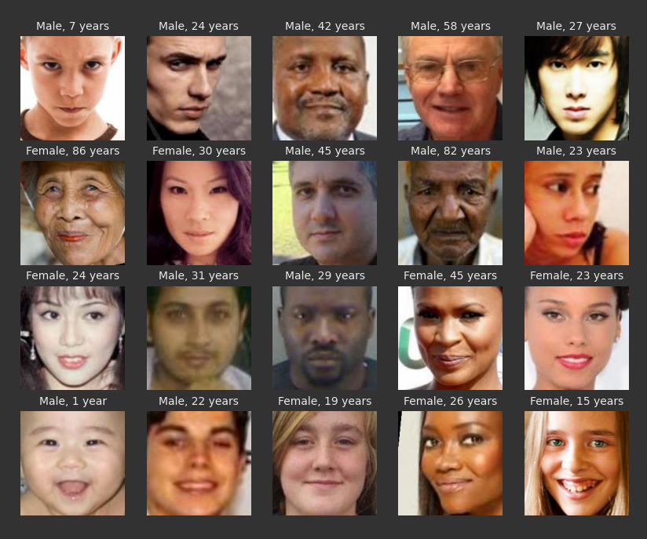
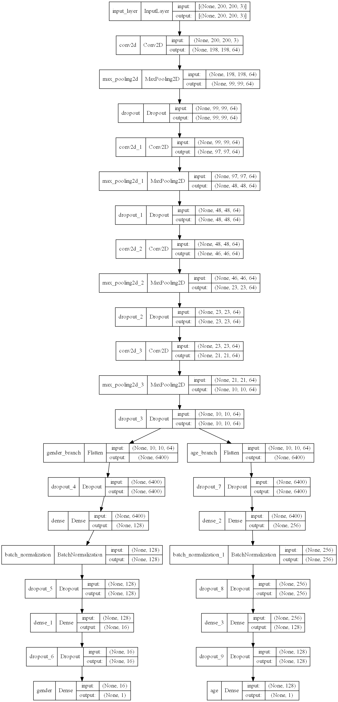
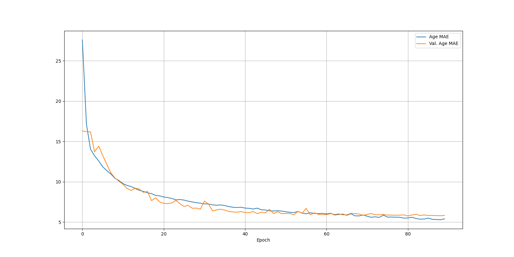
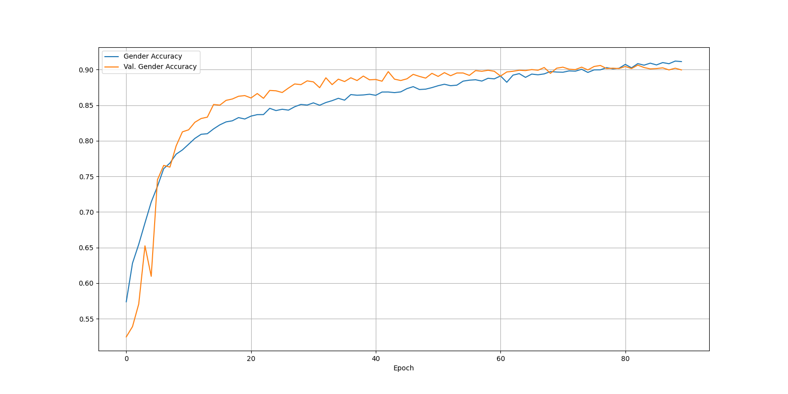
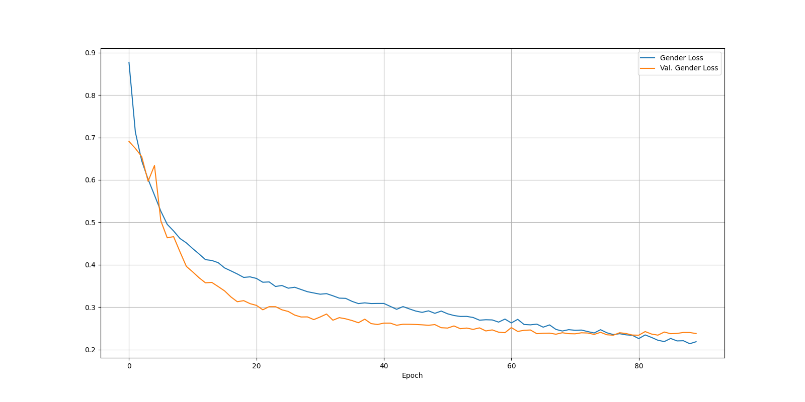
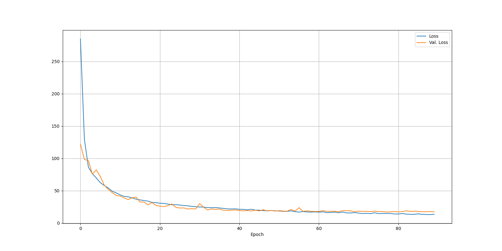
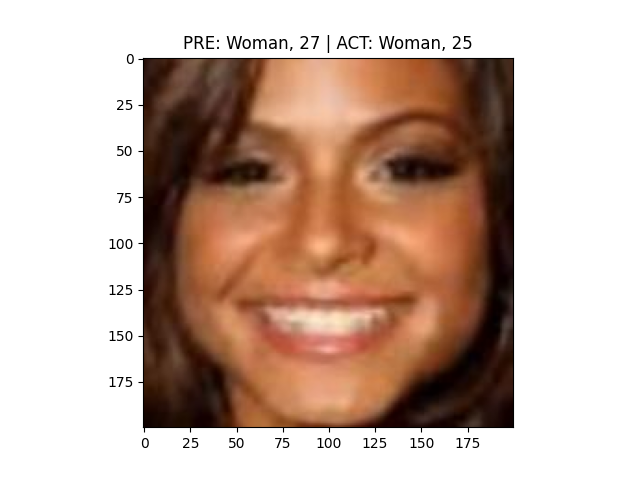
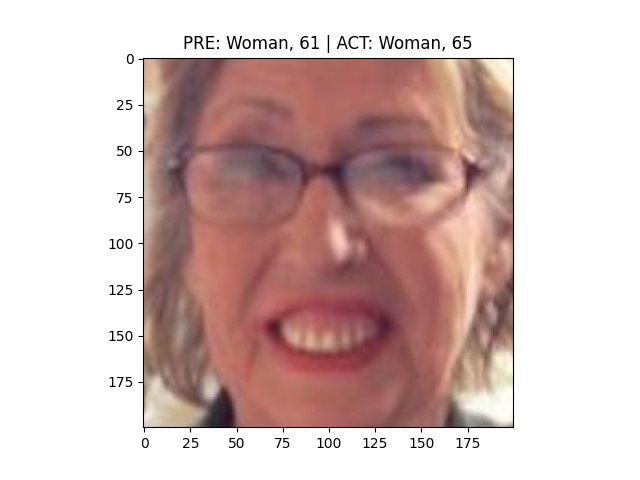
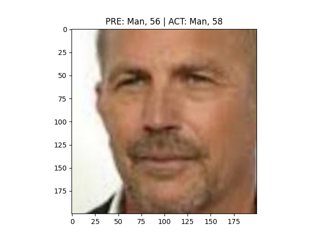

## Convolutional Neural Network (CNN).

#### This repository contains a source code of a deep learning network built with TensorFlow and Keras to classify gender and estimate age.

<br />

### Dataset

[UTKFace. Large Scale Face Dataset](https://susanqq.github.io/UTKFace/)

1. Download the file containing [Aligned&Cropped Faces](https://drive.google.com/drive/folders/0BxYys69jI14kU0I1YUQyY1ZDRUE?usp=sharing)
   archive. The repository contains 23,708 images with annotations encoded in the filename.
   All images have 200*200 px resolution.
2. Unpack the contents into the `./src/all_images` folder.

<br />

#### Example input images with actual gender and age:


<br />

### Application

1. [Create and activate a virtual environment.](https://python.land/virtual-environments/virtualenv)
2. Install project dependencies with `pip install -r requirements.txt`
3. Run the `start.py` file.
4. When running for the first time, select option 1 to split the images into train, validation and test subfolders.
   There is no need to repeat this operation every time.
5. The main menu includes an option to check if your system supports GPU training.
6. A pre-trained model is included in the `/.output/models` folder. Feel free to overwrite or delete it.

<br />

### CNN Architecture



<br />

### Performance

The file `history/age_gender_model.csv` contains the training history.

#### Age - Mean Average Error (MAE)


#### Gender - Accuracy


#### Gender - Loss

 
#### Loss


<br />

### Inference

Run `test the model` option from main menu to load a few images and predict age and gender.





<br />

### GPU Support

Tune down the `batch_size` hyperparameter if your GPU runs out of memory. 

Tensorflow version that currently supports GPU with the latest CUDA / CUDNN.

```
pip install tf-nightly-gpu
```

### Graphviz

You might require to install the Graphviz plotting library.

If you encounter an issue with plotting in your IDE, refer to this
[Stack Overflow answer](Graphvis issue with plotting](https://stackoverflow.com/a/62611005/6666457)

#### Type in the terminal with admin rights:

```
dot -c
```
